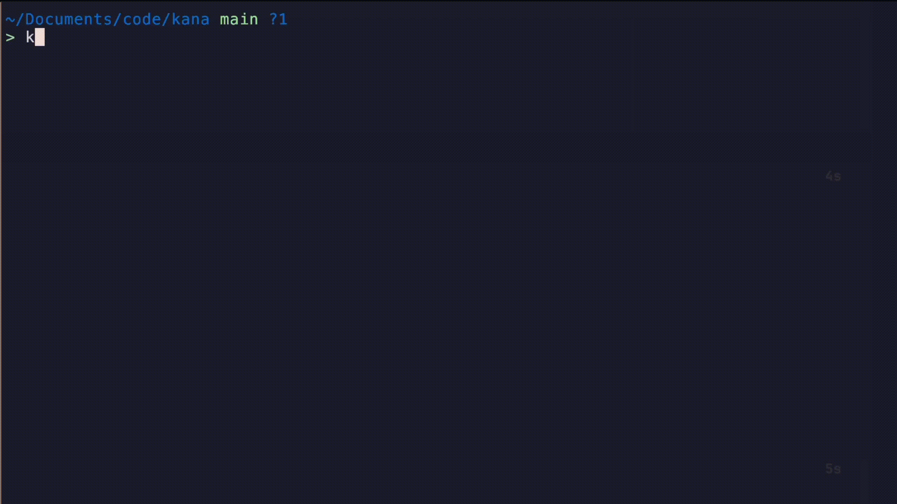

# kana practice
Terminal app to practice typing Kana (Japanese characters) in Romaji. Built with [bubbletea](https://github.com/charmbracelet/bubbletea)

### Install

#### Golang

```bash
go install github.com/dunkbing/kana@latest
```

### How to use

```bash
Usage: kana [--help] [--katakana] [--hiragana]

Options:
  --help  Show this help message and exit
  --kata  Practice Katakana words
  --hira  Practice Hiragana words

If no option is provided, both Katakana and Hiragana words will be displayed.

This app displays a random Katakana or Hiragana word, and you need to type the corresponding Romaji representation. Press Enter to submit your answer.

Example:
Word displayed: あい
You type: ai (then press Enter)
 ```

### Demo

